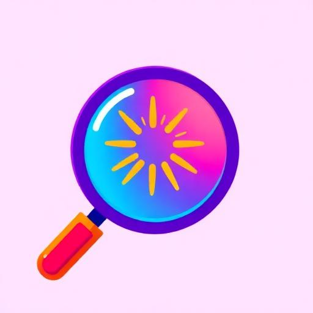
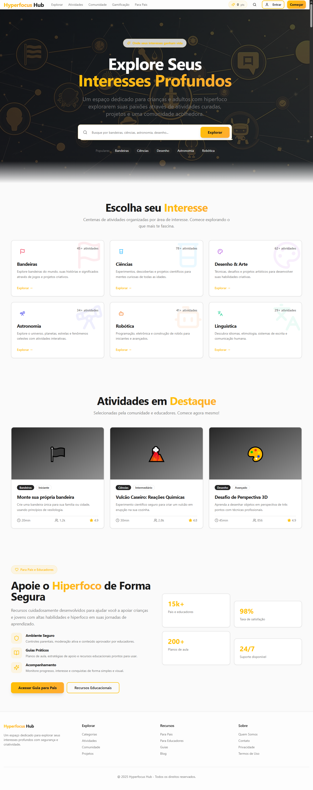
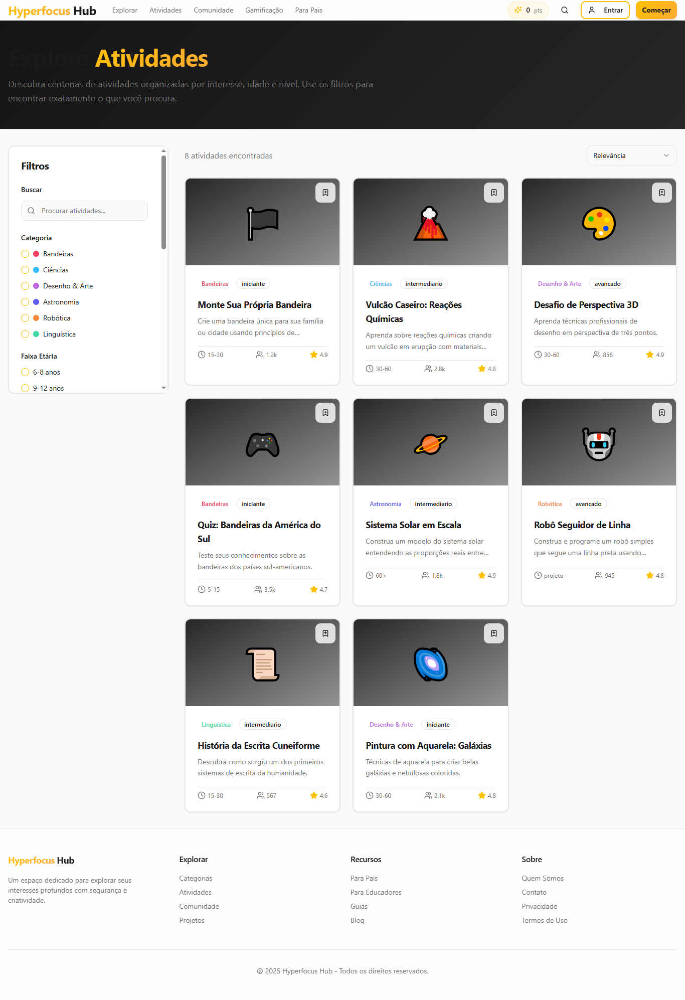
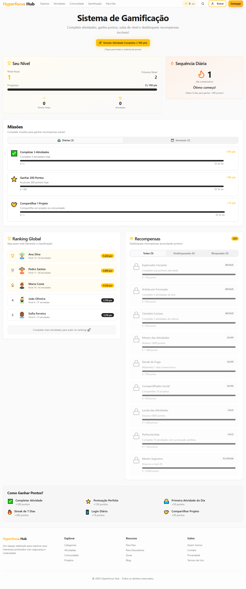
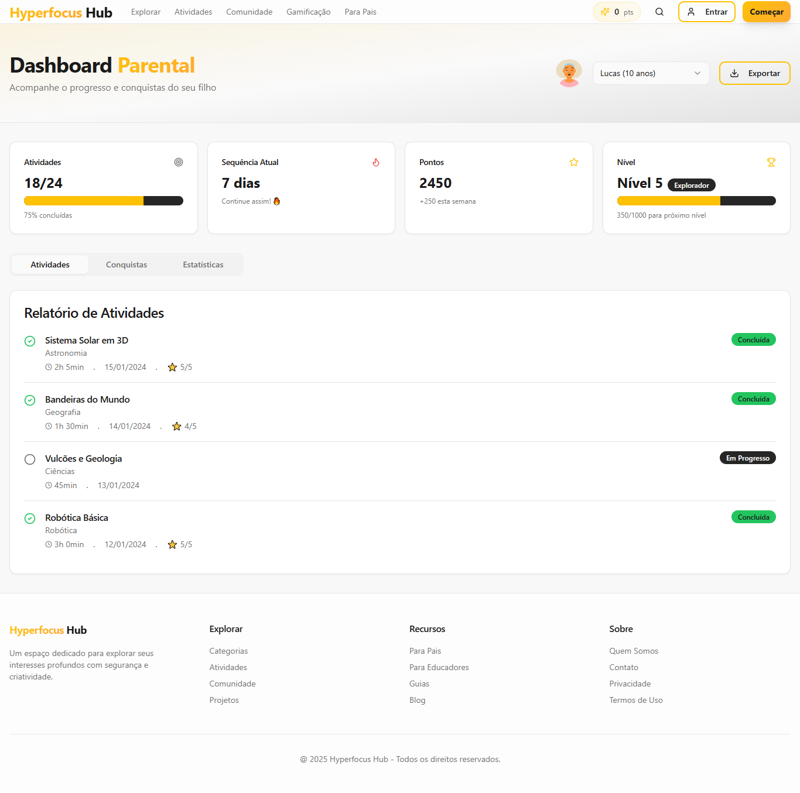
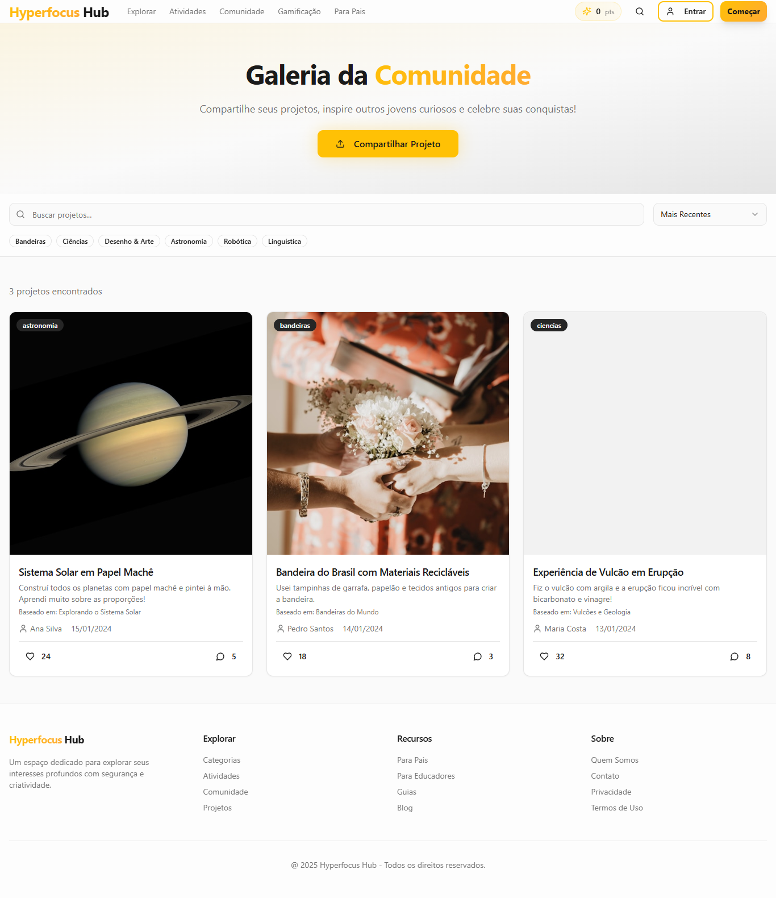

<p align="center">
  
</p>

<h1 align="center">🎯 Hyperfocus Hub</h1>

<p align="center">
  <strong>Plataforma educacional gamificada para crianças explorarem seus interesses através de atividades criativas</strong>
</p>

<p align="center">
  <a href="#-sobre-o-projeto">Sobre</a> •
  <a href="#-funcionalidades">Funcionalidades</a> •
  <a href="#-tecnologias">Tecnologias</a> •
  <a href="#-estrutura">Estrutura</a> •
  <a href="#-instalação">Instalação</a> •
  <a href="#-ods">ODS</a> •
  <a href="#-screenshots">Screenshots</a>
</p>

<p align="center">
  
  
  
  
</p>

---

## 📋 Sobre o Projeto

O **Hyperfocus Hub** é uma plataforma web educacional desenvolvida para ajudar crianças a descobrirem e explorarem seus interesses através de atividades práticas e criativas. O projeto nasceu da necessidade de oferecer uma alternativa digital saudável que estimule a criatividade, o aprendizado e o desenvolvimento infantil.

### 🎯 Problema Identificado

Muitas crianças passam tempo excessivo em dispositivos digitais consumindo conteúdo passivo, sem estímulo criativo ou educacional significativo. Pais enfrentam dificuldade em encontrar atividades estruturadas que mantenham o interesse dos filhos.

### 💡 Solução Proposta

Uma plataforma que transforma o tempo de tela em momentos produtivos de aprendizado, oferecendo:
- Atividades guiadas passo a passo
- Sistema de gamificação para manter o engajamento
- Acompanhamento parental do progresso
- Comunidade para compartilhar criações

---

## ✨ Funcionalidades

### 🏠 Página Inicial
- Hero section com busca inteligente
- Categorias de atividades em destaque
- Atividades recomendadas
- Seção informativa para pais

### 🔍 Explorar Atividades
- Catálogo completo de atividades
- Filtros avançados (categoria, idade, duração, dificuldade)
- Visualização em grid responsivo
- Busca por palavras-chave

### 📝 Página de Atividade
- Instruções detalhadas passo a passo
- Lista de materiais com checklist
- Temporizador integrado
- Opção de impressão

### 🎮 Sistema de Gamificação
- **Pontos XP**: Ganhos ao completar atividades
- **Níveis**: Progressão do usuário
- **Conquistas**: Medalhas desbloqueáveis
- **Sequência diária**: Incentivo à consistência
- **Missões**: Desafios diários e semanais
- **Ranking**: Competição saudável

### 👨‍👩‍👧 Dashboard dos Pais
- Seleção de múltiplos filhos
- Gráfico de atividades semanais
- Relatório de progresso
- Lista de conquistas
- Histórico completo de atividades

### 🌐 Comunidade
- Galeria de projetos compartilhados
- Sistema de curtidas
- Comentários com moderação
- Upload de criações

---

## 🛠 Tecnologias

### Frontend
| Tecnologia | Versão | Descrição |
|------------|--------|-----------|
| React | 18.3.1 | Biblioteca para construção de interfaces |
| TypeScript | 5.0+ | Superset JavaScript com tipagem estática |
| Vite | 5.0+ | Build tool e dev server ultrarrápido |
| Tailwind CSS | 3.4+ | Framework CSS utilitário |
| React Router | 6.30+ | Roteamento SPA |

### Componentes e UI
| Tecnologia | Descrição |
|------------|-----------|
| shadcn/ui | Componentes acessíveis e customizáveis |
| Radix UI | Primitivos de UI sem estilo |
| Lucide React | Biblioteca de ícones |
| Framer Motion | Animações fluidas |
| Recharts | Gráficos e visualizações |

### Ferramentas de Desenvolvimento
| Tecnologia | Descrição |
|------------|-----------|
| ESLint | Linting de código |
| React Query | Gerenciamento de estado servidor |
| React Hook Form | Formulários performáticos |
| Zod | Validação de schemas |
| date-fns | Manipulação de datas |

---

## 📁 Estrutura do Projeto

```
hyperfocus-hub/
├── 📂 public/                    # Arquivos públicos
│   ├── favicon.png               # Ícone do site
│   └── robots.txt                # Configuração para crawlers
│
├── 📂 src/                       # Código fonte
│   ├── 📂 assets/                # Imagens e recursos
│   │   └── hero-banner.jpg       # Banner principal
│   │
│   ├── 📂 components/            # Componentes React
│   │   ├── 📂 atividade/         # Componentes da página de atividade
│   │   │   ├── ActivityTimer.tsx
│   │   │   ├── MaterialsList.tsx
│   │   │   ├── PrintButton.tsx
│   │   │   └── StepsList.tsx
│   │   │
│   │   ├── 📂 comunidade/        # Componentes da comunidade
│   │   │   ├── CommentsDialog.tsx
│   │   │   ├── ProjectCard.tsx
│   │   │   └── ProjectUploadDialog.tsx
│   │   │
│   │   ├── 📂 dashboard/         # Componentes do dashboard
│   │   │   ├── AchievementsList.tsx
│   │   │   ├── ActivityReport.tsx
│   │   │   ├── ChildSelector.tsx
│   │   │   ├── ProgressOverview.tsx
│   │   │   └── WeeklyChart.tsx
│   │   │
│   │   ├── 📂 explorar/          # Componentes de exploração
│   │   │   ├── ActivityGrid.tsx
│   │   │   └── FilterPanel.tsx
│   │   │
│   │   ├── 📂 gamification/      # Sistema de gamificação
│   │   │   ├── CelebrationOverlay.tsx
│   │   │   ├── DailyStreak.tsx
│   │   │   ├── Leaderboard.tsx
│   │   │   ├── LevelProgress.tsx
│   │   │   ├── MissionsPanel.tsx
│   │   │   ├── PointsDisplay.tsx
│   │   │   └── RewardsGallery.tsx
│   │   │
│   │   ├── 📂 ui/                # Componentes shadcn/ui (50+ componentes)
│   │   │
│   │   ├── CategoriesSection.tsx # Seção de categorias
│   │   ├── CategoryCard.tsx      # Card de categoria
│   │   ├── FeaturedActivities.tsx# Atividades em destaque
│   │   ├── Footer.tsx            # Rodapé
│   │   ├── Header.tsx            # Cabeçalho/Navegação
│   │   ├── Hero.tsx              # Seção hero
│   │   ├── NavLink.tsx           # Link de navegação
│   │   ├── ParentsSection.tsx    # Seção para pais
│   │   └── SearchDialog.tsx      # Modal de busca
│   │
│   ├── 📂 contexts/              # Contextos React
│   │   └── GamificationContext.tsx
│   │
│   ├── 📂 hooks/                 # Hooks customizados
│   │   ├── use-mobile.tsx
│   │   └── use-toast.ts
│   │
│   ├── 📂 lib/                   # Utilitários
│   │   ├── confetti.ts           # Efeitos de confete
│   │   └── utils.ts              # Funções auxiliares
│   │
│   ├── 📂 pages/                 # Páginas da aplicação
│   │   ├── Atividade.tsx         # Detalhes da atividade
│   │   ├── Comunidade.tsx        # Comunidade/Galeria
│   │   ├── DashboardPais.tsx     # Painel dos pais
│   │   ├── Explorar.tsx          # Catálogo de atividades
│   │   ├── Gamificacao.tsx       # Sistema de recompensas
│   │   ├── Index.tsx             # Página inicial
│   │   └── NotFound.tsx          # Página 404
│   │
│   ├── 📂 types/                 # Definições TypeScript
│   │   ├── activity.ts
│   │   ├── dashboard.ts
│   │   ├── gamification.ts
│   │   └── project.ts
│   │
│   ├── App.css                   # Estilos globais
│   ├── App.tsx                   # Componente raiz
│   ├── index.css                 # Configuração Tailwind
│   ├── main.tsx                  # Ponto de entrada
│   └── vite-env.d.ts             # Tipos do Vite
│
├── .gitignore                    # Arquivos ignorados pelo Git
├── components.json               # Configuração shadcn/ui
├── eslint.config.js              # Configuração ESLint
├── GUIA_INSTALACAO.md            # Guia detalhado de instalação
├── index.html                    # HTML principal
├── package.json                  # Dependências do projeto
├── postcss.config.js             # Configuração PostCSS
├── tailwind.config.ts            # Configuração Tailwind
├── tsconfig.json                 # Configuração TypeScript
└── vite.config.ts                # Configuração Vite
```

---

## 🚀 Instalação

### Pré-requisitos

- Node.js 18+ ([Instalar com nvm](https://github.com/nvm-sh/nvm))
- npm ou yarn
- Git

### Passo a Passo

```bash
# 1. Clone o repositório
git clone <https://github.com/almeida89/hyperfocus-hub.git>

# 2. Entre na pasta do projeto
cd hyperfocus-hub

# 3. Instale as dependências
npm install

# 4. Inicie o servidor de desenvolvimento
npm run dev

# 5. Acesse no navegador
# http://localhost:5173
```

### Scripts Disponíveis

| Comando | Descrição |
|---------|-----------|
| `npm run dev` | Inicia servidor de desenvolvimento |
| `npm run build` | Gera build de produção |
| `npm run preview` | Preview do build local |
| `npm run lint` | Executa verificação de código |

---

## 🌍 ODS - Objetivos de Desenvolvimento Sustentável

O Hyperfocus Hub está alinhado com os seguintes Objetivos de Desenvolvimento Sustentável da ONU:

### 📚 ODS 4 - Educação de Qualidade
> "Assegurar a educação inclusiva e equitativa de qualidade, e promover oportunidades de aprendizagem ao longo da vida para todos"

**Como o projeto contribui:**
- Oferece atividades educativas estruturadas e acessíveis
- Estimula diferentes tipos de inteligência (visual, cinestésica, lógica)
- Democratiza o acesso a conteúdo educacional de qualidade
- Promove aprendizagem autodirigida e criativa

### 💚 ODS 3 - Saúde e Bem-estar
> "Assegurar uma vida saudável e promover o bem-estar para todos"

**Como o projeto contribui:**
- Incentiva atividades que desenvolvem coordenação motora
- Promove saúde mental através de atividades criativas
- Oferece alternativa saudável ao tempo de tela passivo
- Estimula interação familiar através de atividades conjuntas

### ⚖️ ODS 10 - Redução das Desigualdades
> "Reduzir a desigualdade dentro dos países e entre eles"

**Como o projeto contribui:**
- Plataforma gratuita e acessível
- Interface intuitiva para diferentes níveis de letramento digital
- Atividades com materiais simples e acessíveis
- Design responsivo para diversos dispositivos

---

## 📸 Screenshots

### Página Inicial
A página inicial apresenta as principais categorias de atividades e convida o usuário a explorar.



### Explorar Atividades
Interface com filtros avançados para encontrar a atividade perfeita por idade, duração, categoria e dificuldade.



### Sistema de Gamificação
Tela de recompensas com pontos, níveis, conquistas, missões diárias e ranking para manter o engajamento.



### Dashboard dos Pais
Painel completo para acompanhamento do progresso dos filhos, com gráficos e relatórios detalhados.



### Comunidade
Galeria colaborativa onde usuários compartilham suas criações e interagem através de curtidas e comentários.



---

## 🎯 Público-Alvo

| Perfil | Faixa Etária | Necessidades |
|--------|--------------|--------------|
| **Crianças** | 4-12 anos | Atividades divertidas e educativas |
| **Pais** | 25-45 anos | Acompanhar progresso, conteúdo seguro |
| **Educadores** | - | Recursos para complementar ensino |

---

## 📊 Métricas de Sucesso

- **Engajamento**: Tempo médio por sessão, atividades completadas
- **Retenção**: Taxa de retorno diário/semanal
- **Satisfação**: Avaliações das atividades
- **Comunidade**: Projetos compartilhados e interações

---

## 🔮 Roadmap Futuro

- [ ] Autenticação de usuários
- [ ] Banco de dados persistente
- [ ] Sistema de notificações
- [ ] App mobile (React Native)
- [ ] Modo offline
- [ ] Integração com escolas
- [ ] Mais categorias de atividades
- [ ] Sistema de busca avançado com IA

---

## 👥 Equipe

| Papel | Responsabilidades |
|-------|-------------------|
| **Desenvolvedor Full Stack** | Arquitetura, Frontend, Integração |
| **UI/UX Designer** | Interface, Experiência do Usuário |
| **Product Owner** | Definição de requisitos, Priorização |

---

## 📄 Licença

Este projeto foi desenvolvido como parte de um trabalho acadêmico.

---

## 🔗 Links Úteis

- [Documentação React](https://react.dev/)
- [Documentação TypeScript](https://www.typescriptlang.org/docs/)
- [Tailwind CSS](https://tailwindcss.com/docs)
- [shadcn/ui](https://ui.shadcn.com/)
- [ODS da ONU](https://brasil.un.org/pt-br/sdgs)

---


<p align="center">
  <sub>Hyperfocus Hub © 2024</sub>
</p>
